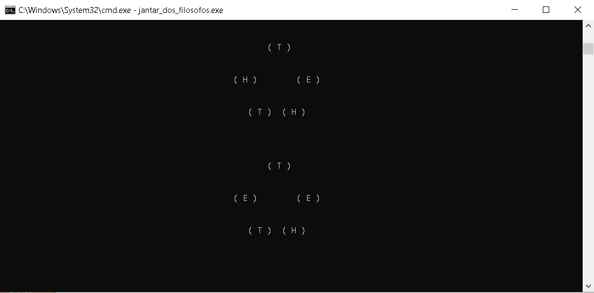

# :mortar_board: O Problema do Jantar dos Filósofos 
O repositório tem como objetivo registrar uma solução para o problema do jantar dos filósofos utilizando threads e semáforos. Trata-se de um dos problemas clássicos de comunicação entre processos. O código foi utilizado como resposta para uma atividade proposta na disciplina de Sistemas Operacionais. 

# :thought_balloon: Definindo o Problema
O contexto se trata de um conjunto de cinco filósofos reunidos em uma mesa circular que irão jantar macarronada. 
Ao todo são cinco pratos de macarronada e cinco garfos para a alimentação. O problema surge quando cada filósofo 
precisa usar dois garfos para se alimentar (aqui não vale querer facilitar as coisas :laughing:); um dos garfos estando no ao seu lado direito, o outro ao seu lado esquerdo.
O filósofos podem se encontrar em três estados diferentes: comendo (efetivamente se alimentado e, portanto, utilizando
os dois garfos a sua volta), com fome (ele quer comer, porém não pode pois não há garfos suficientes disponíveis) ou pensando (apenas filosofando sobre a vida).

# :computer: O Programa 
A ideia era desenvolver um algoritmo que resolvesse o problema do jantar dos filósofos de forma que mais de um filósofo
possa comer ao mesmo tempo (garantindo assim a multiprogramação), mas sem permitir que eles sejam vizinhos (garantindo assim o acesso restrito ao recurso compartilhado, os garfos, evitando possíveis condições de corrida). Para demonstrar de maneira visual o funcionamento o programa da maneira como foi pedido, resolvi gerar como saída do código o print de uma lista circular com o estado de cada filósofo. Dá uma olhada em como ficou:

O algoritmo se resume ao código jantar_dos_filosofos.c>. Ele tem alguns comentários com o intuito de auxiliar no entendimento do que é feito. Confere lá :smiley:.

# :gear: Como usar
Para gerar o executável do algoritmo na sua máquina, basta abrir o prompt de comando ou terminal no diretório do arquivo e 
executar o comando:

Windows: `gcc nome_do_codigo.c -"lpthread"`

Linux: `gcc pthread -o nome_do_arquivo nome_do_arquivo.c`

Para executar o código, basta executar o seguinte comando no mesmo diretório:

`nome_do_executavel.exe`
